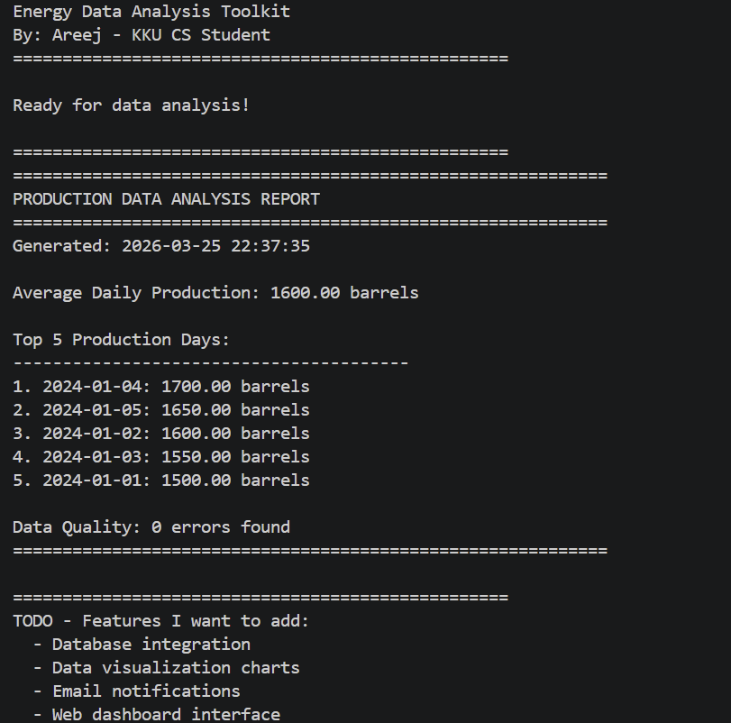
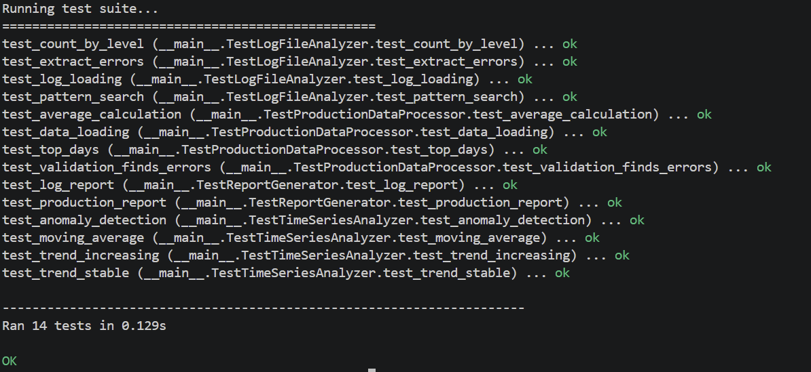

# Energy Data Analysis Toolkit

A Python toolkit for analyzing industrial energy and production data.

## About

I built this project while learning about data analysis and its applications in the oil & gas industry. As a Computer Science student at KKU, I wanted to create something practical that goes beyond typical academic projects.

**What started it:** Got interested in how the energy sector uses data analysis after reading about industry applications in my Data Structures course.

**Current status:** Working and functional. Still adding features as I learn more.

## Features

The toolkit can:

- Process production data from CSV files
- Validate data and catch common errors
- Analyze system log files
- Calculate statistics (averages, trends, etc.)
- Detect anomalies in time-series data
- Generate formatted reports
## Screenshots
### Production Report


### Test Results

## Quick Start
### Installation

```bash
# Clone the repository
git clone https://github.com/Areej-cs/energy-data-toolkit.git
cd energy-data-toolkit

# No external libraries needed - uses Python standard library
python --version  # Make sure you have Python 3.6+
```
### Basic Usage
```
from energy_toolkit import ProductionDataProcessor, ReportGenerator

# Load your data
processor = ProductionDataProcessor('production_data.csv')

# Generate analysis report
report = ReportGenerator.generate_production_report(processor)
print(report)

# Check for data quality issues
errors = processor.validate_data()
print(f"Found {len(errors)} errors")
```
### Working with Logs
```
from energy_toolkit import LogFileAnalyzer

# Analyze log files
analyzer = LogFileAnalyzer('system.log')

# Count errors by type
counts = analyzer.count_by_level()
print(f"Errors: {counts.get('ERROR', 0)}")

# Find specific issues
sensor_issues = analyzer.find_pattern('sensor.*fault')
```

### Time Series Analysis
```
from energy_toolkit import TimeSeriesAnalyzer

# Your production data
daily_production = [1500, 1520, 1510, 1530, 1525, 1540]

analyzer = TimeSeriesAnalyzer(daily_production)

# Check trend
trend = analyzer.calculate_trend()
print(f"Trend: {trend}")  # increasing, decreasing, or stable

# Find anomalies
anomalies = analyzer.detect_anomalies(threshold=2.0)
if anomalies:
    print(f"Found unusual values at: {anomalies}")
```
 ## Project Structure
 ```
 energy-data-toolkit/
│
├── energy_toolkit.py          # Main code
├── test_energy_toolkit.py     # Unit tests
├── README.md                  # This file
│
├── examples/                  # Sample data
│   ├── production_data.csv
│   └── system.logs
│
└── docs/                      # Additional notes
    └── Screenshot1.png
    └── Screenshot2.png
```
## Testing
Run the test suite to make sure everything works: 
```  
python test_energy_toolkit.py
```
All tests should pass if you get errors, check:

Python version (needs 3.6+)
File paths are correct
CSV format matches expected structure

## Data Format
### Production Data CSV
```
date,production
2024-01-01,1500
2024-01-02,1600
2024-01-03,1550
2024-01-04,1700
2024-01-05,1650
```
Required columns: date, production

### Log Files
Standard log format with severity levels (INFO, WARNING, ERROR):
```
2024-01-01 10:00:00 INFO System started
2024-01-01 10:05:00 ERROR Connection timeout
```
## What I Learned

### Building this taught me:

Technical Skills:

CSV file handling in Python
Object-oriented programming
Unit testing with unittest
Statistical analysis basics
Regular expressions for log parsing

Problem Solving:

Handling invalid data gracefully
Error detection strategies
Performance optimization for larger files
Code organization and structure

Challenges I Faced:

Getting the anomaly detection algorithm right (took several tries)
Handling different CSV formats and encodings
Writing good test cases
Making code reusable and clean

## Future Plans
Things I want to add:

 Database support (PostgreSQL or SQLite)
 Data visualization with matplotlib
 REST API for remote access
 Real-time data streaming
 Web-based dashboard
 Email alerts for critical issues
 More statistical analysis methods
 Export to Excel format

## Known Issues
Very large CSV files (>100MB) can be slow - need to add chunking
Some edge cases in date parsing not fully handled
Documentation could be more detailed

## Contributing
This is a learning project, but suggestions and improvements are welcome! If you find bugs or have ideas, feel free to open an issue

## Technical Notes
Why These Choices?

No external libraries: Wanted to understand the fundamentals before using frameworks

Object-oriented design: Makes it easier to extend and maintain

Type hints: Help catch errors early (when I remember to use them)

Simple file I/O: CSV is universal and easy to work with

Performance
Handles ~50,000 records comfortably
Memory usage scales linearly with data size
Log file analysis is pretty fast even for large files

## Resources I Used
While learning and building this:

Python documentation (especially csv and statistics modules)
Real World Python by Lee Vaughan
Stack Overflow (for specific problems)
Various tutorials on data analysis

## Contact
hosoh5679@gmail.com
GitHub: [Areej-cs]

## License
MIT License - feel free to use and modify


Note: This is an ongoing learning project. Code might not be perfect, and I’m actively working on improvements. Feedback appreciated!
